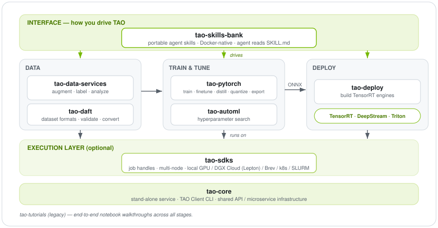

<!--
  NVIDIA TAO — GitHub organization profile README.
  Place this file at .github/profile/README.md in the organization's
  special ".github" repository to have it render on https://github.com/NVIDIA-TAO
-->

<div align="center">
  

# NVIDIA TAO Toolkit

  **Train, Adapt, and Optimize state-of-the-art AI models.**

  [](https://github.com/NVIDIA-TAO/tao-pytorch/blob/main/LICENSE)
  [](https://docs.nvidia.com/tao/tao-toolkit/text/overview.html)
  [](https://catalog.ngc.nvidia.com/)
  [](https://huggingface.co/nvidia)

</div>

---

## What is TAO?

NVIDIA TAO is a Python-based AI toolkit built on PyTorch (with legacy TensorFlow
support) for computer vision, multimodal, and 3D perception. It abstracts away
the complexity of model architectures and the underlying deep learning
frameworks so you can take an NVIDIA pretrained model, fine-tune it on your own
data with transfer learning, and optimize it for high-throughput inference.

The output of a TAO workflow is a trained model ready to deploy on NVIDIA
hardware with **TensorRT**, **DeepStream**, or **Triton**.

## Start here → agent skills

The fastest way into TAO is the **[TAO Skill Bank](https://github.com/NVIDIA-TAO/tao-skill-bank)** —
portable agent skills that let a coding agent (Claude Code, Codex, Gemini CLI, or
anything speaking the [Agent Skills open standard](https://agentskills.io)) train,
fine-tune, and run inference on TAO models. **Zero Python required** for local
Docker workflows: install the plugin, have Docker + the NVIDIA Container Toolkit,
and the agent constructs `docker run` commands for you.

```text
# In a Claude Code session
/plugin marketplace add git@github.com:NVIDIA-TAO/tao-skill-bank.git
/plugin install tao-skills@tao-skill-bank
```

Prefer to follow docs? See the
**[Getting Started guide](https://docs.nvidia.com/tao/tao-toolkit/text/tao_toolkit_quick_start_guide.html)**
in the TAO documentation. The legacy notebook walkthroughs live in
**[tao-tutorials](https://github.com/NVIDIA-TAO/tao-tutorials)**.

## Repositories

All nine repositories are public and Apache-2.0 licensed.

**Get started**

| Repository | What it is |
| :--- | :--- |
| **[tao-skill-bank](https://github.com/NVIDIA-TAO/tao-skill-bank)** | Portable agent skills for training, data prep, deployment, and end-to-end workflows across coding agents (Claude Code, Codex, Gemini CLI). Docker-native, no Python required to start. |
| **[tao-tutorials](https://github.com/NVIDIA-TAO/tao-tutorials)** | Legacy quick-start scripts and notebooks that run TAO end-to-end. Kept for reference; new users should start with the skill bank. |

**Core toolkit**

| Repository | What it is |
| :--- | :--- |
| **[tao-pytorch](https://github.com/NVIDIA-TAO/tao-pytorch)** | The PyTorch backend: 25+ model families for training, fine-tuning, evaluation, distillation, quantization (QAT), and ONNX export. |
| **[tao-deploy](https://github.com/NVIDIA-TAO/tao-deploy)** | Deployment package — builds TensorRT engines and runs optimized inference and evaluation. |
| **[tao-core](https://github.com/NVIDIA-TAO/tao-core)** | TAO as a stand-alone service, the TAO Client CLI, and shared API / microservice infrastructure. |

**Data**

| Repository | What it is |
| :--- | :--- |
| **[tao-data-services](https://github.com/NVIDIA-TAO/tao-data-services)** | Data annotation, augmentation, auto-labeling, and analytics tooling. |
| **[tao-daft](https://github.com/NVIDIA-TAO/tao-daft)** | Dataset Annotation Format Toolkit — JSON-schema specs plus a CLI/Python validator and converters for vision-language dataset formats. |

**Automation & orchestration**

| Repository | What it is |
| :--- | :--- |
| **[tao-automl](https://github.com/NVIDIA-TAO/tao-automl)** | AutoML for TAO — automated hyperparameter search to tune models with minimal manual effort. |
| **[tao-sdks](https://github.com/NVIDIA-TAO/tao-sdks)** | TAO Execution SDK — optional Python layer on top of the skill bank for job handles, background polling, S3 I/O, multi-node training, and DGX Cloud (Lepton) / Brev submission. |

## How the repos fit together

<p align="center">
  
</p>

## What you can build

TAO ships a console command per model family. A snapshot of what's supported in
the PyTorch backend:

- **Object detection & grounding** — `dino`, `deformable_detr`, `rtdetr`, `grounding_dino`, `mask_grounding_dino`
- **Segmentation** — `segformer`, `mask2former`, `oneformer`
- **Classification & metric learning** — `classification_pyt`, `ml_recog`, `re_identification`
- **OCR** — `ocdnet`, `ocrnet`
- **Pose, action & inspection** — `centerpose`, `pose_classification`, `action_recognition`, `optical_inspection`, `visual_changenet`
- **3D / point cloud** — `pointpillars`, `bevfusion`, `sparse4d`
- **3D scene reconstruction** — `nvpanoptix3d` (single-image panoptic 3D reconstruction: depth, 2D/3D panoptic, TSDF geometry; non-commercial)
- **Multimodal & foundation** — `clip`, `radio`, `nvdinov2`, `mae`
- **Synthetic data & depth** — `stylegan_xl`, `depth_net`

Most families support the full lifecycle: `train`, `evaluate`, `inference`,
`export`, and — where applicable — `distill`, `quantize`, and `prune`.

## Pretrained models

Fine-tune from NVIDIA pretrained and foundation models, hosted on:

- **[NGC](https://catalog.ngc.nvidia.com/)** — purpose-built TAO models with model cards and licenses.
- **[Hugging Face (nvidia)](https://huggingface.co/nvidia)** — including [C-RADIOv3](https://huggingface.co/nvidia/C-RADIOv3-H), [Cosmos-Embed1](https://huggingface.co/nvidia/Cosmos-Embed1-448p-anomaly-detection), and the [nvPanoptix-3D collection](https://huggingface.co/collections/nvidia/nvpanoptix-3d).

## Ways to run TAO

Agent skills (**tao-skill-bank**), prebuilt **containers**, **Python wheels**,
or directly from **source**. Scale out to multi-node or **DGX Cloud (Lepton)**
and **Brev** via the **[tao-sdks](https://github.com/NVIDIA-TAO/tao-sdks)**
execution layer.

## License

All repositories are released under the **Apache-2.0** license. Pretrained model
and container licenses are described on their respective NGC model cards.

## Learn more

- 🚀 [Getting Started guide](https://docs.nvidia.com/tao/tao-toolkit/text/tao_toolkit_quick_start_guide.html)
- 📚 [TAO Documentation](https://docs.nvidia.com/tao/tao-toolkit/text/overview.html)
- 🎥 [TAO quick-start video](https://www.nvidia.com/en-us/on-demand/session/other2022-tao/)
- ✍️ [NVIDIA Developer Blog — TAO](https://developer.nvidia.com/blog/tag/tao-toolkit/)

<div align="center">
  <sub>Built by NVIDIA · Deploy anywhere with TensorRT, DeepStream, and Triton</sub>
</div>
